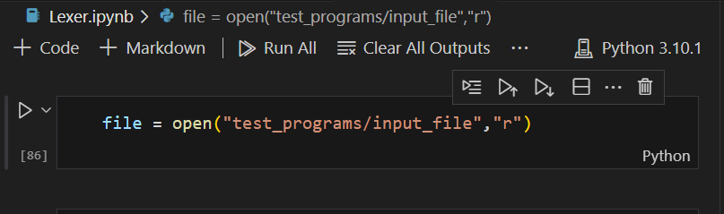
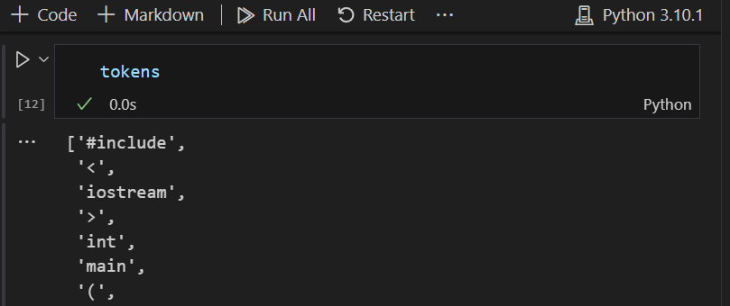
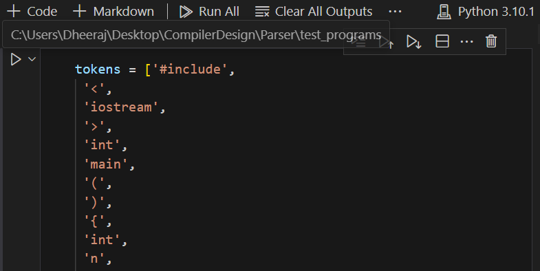

# C++ Parser in Python

This is a Python-based parser designed to parse C++ source code. It provides various information by accepting code in C++ and checking for syntax errors.

## Installation

This parser requires Python. You can install the necessary dependencies using pip:

```bash
pip install "library"
```

## Usage

- Install the necessary libraries.
- Navigate to the directory containing the parser.
- Create a new cpp file or paste an existing cpp file inside the folder named test_programs.
- Write the name of the file to be parsed inside the first code cell in *Lexer.ipynb* in place of "input_file" 



- Use "Run All" command to run *Lexer.ipynb*.
- This will generate the list of tokens present in the provided code as shown below



- Copy and paste the list of tokens produced by *Lexer.ipynb* and paste in the first Code Cell of *parser.ipynb* as shown below



- Use "Run All" command to run *parser.ipynb*.
- The corresponding results will be visible at the bottom of *parser.ipynb*.